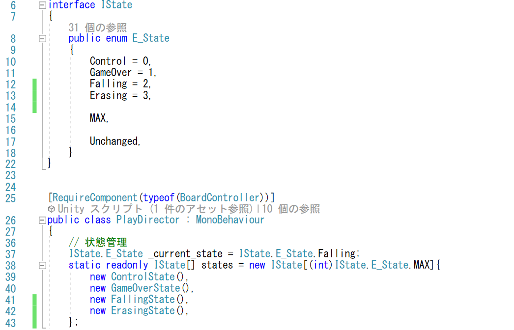
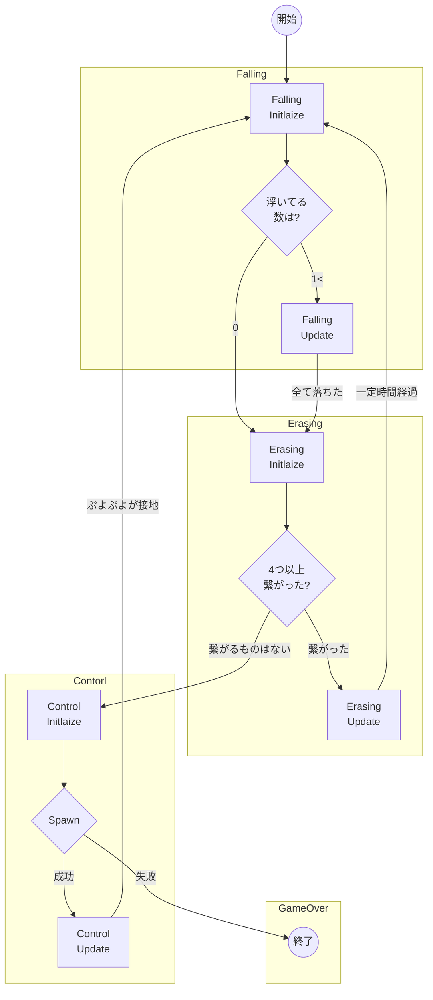
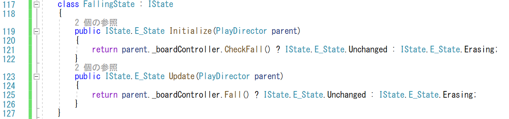
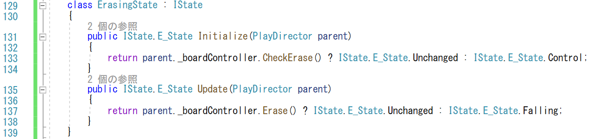
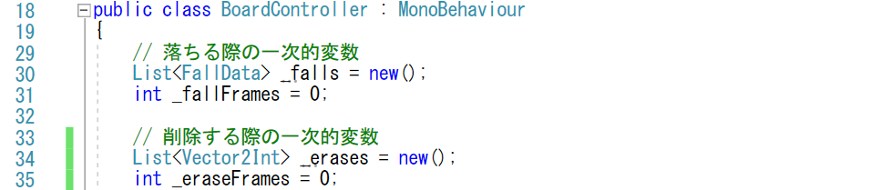
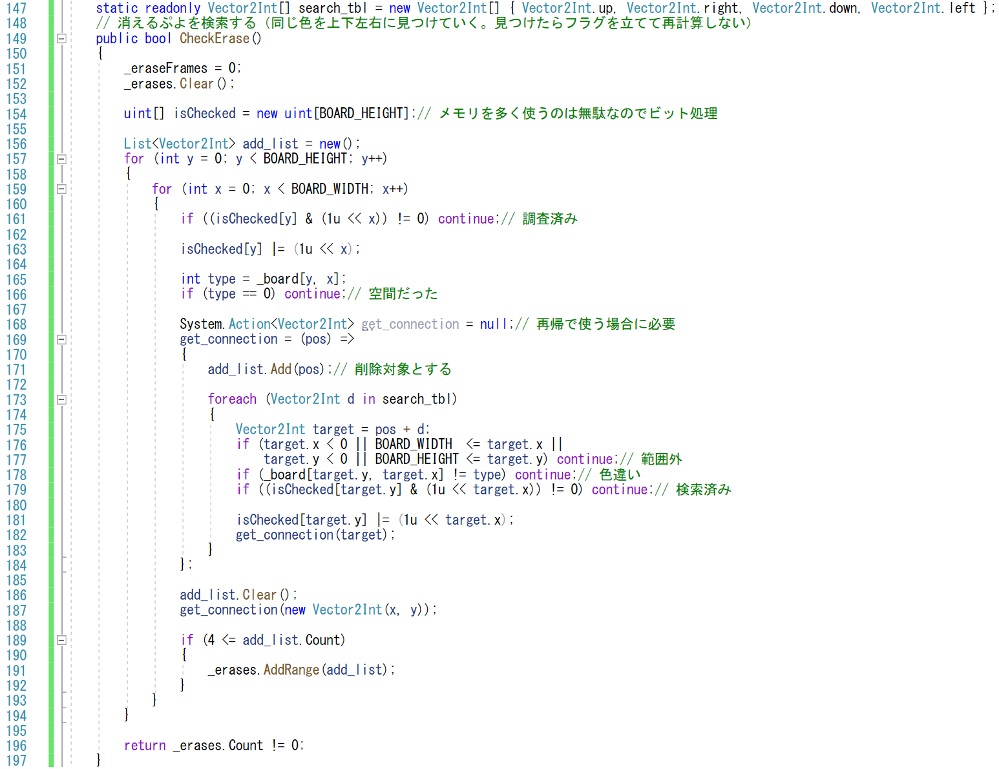
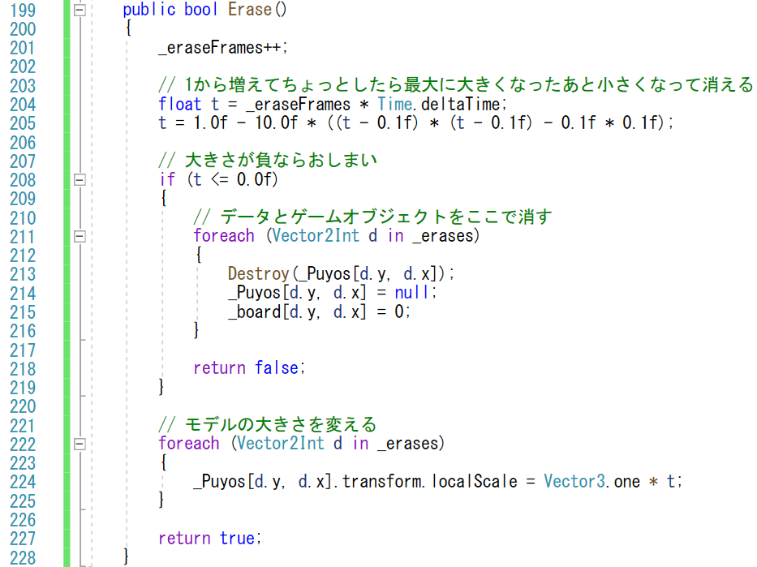

# 概要
今回は、ぷよが4つ集まった時に消える処理です。
これで、通常のプレイが可能となります。

https://user-images.githubusercontent.com/936545/155274391-aca3a91c-1737-47a1-b47f-eb2cba30ad34.mp4

# 手順

ぷよが固定された後、下に何もないぷよは落ちてきます。
その後、上下左右に繋げていって、4つ以上くっついているぷよを消していきます。

## Erasingステートの追加
まずは、PlayDirector.csを編集して新しいステートを追加しましょう。

ステートの種類を IState.E_Stateに追加します。
ぷよを削除するのでErasingという状態を追加します(13行目)。

また、ErasingStateクラスを作ることとして、このクラスをstatesのクラス配列に追加します(42行目)。

## Erasingステートに関する遷移

このFalling状態に関する遷移ですが、少し難しいです。

Falling状態を終えてぷよが全て着いたらErasing状態に写ります。
Erasing状態に遷移たら、ぷよのつながりを調べて、4つ以上繋がっているぷよがなければ、新しいぷよぷよを出すControl状態にうつります。

また、消える物があったら消しますが、ここは軽くアニメーションを付けたいと思います。
アニメーションして、ぷよが消えたら、Erasing状態は終了するのですが、ここは、Control状態には移りません。
消えた結果、下が空間になったぷよはまた落ちてくるので、消えたぷよがあったら、Erasing状態を終えた後はFalling状態に遷移します。
これによって連鎖して消すことができます。

Erasing状態への遷移の実装は、FallingStateクラスのInitializeやUpdateメソッドで落ちる事がなければErasing状態に遷移します(121, 125行目)。

## Erasingステートの実装

次に、ErasingStateクラスの中身を見ていきましょう(129-139行目)。
ErasingStateは、FallingStateクラスと同じように、BoardControllerクラスのメソッドを呼び出すようにすれば、
簡潔で良さそうです。

次のメソッドをBoardControllerクラスに追加します。

- CheckErase: 4つ以上つながっているぷよを検索します
- Erase: 消すぷよをアニメーションで消します。

返り値として消えるぷよがなければControl状態に遷移して(133行目)、ぷよが消えるアニメーションを終えたらFalling状態に遷移します。

## 消えるぷよの検索

では、BoardControllerの中身を実装していきましょう。
追加する処理の構造は、落ちる処理と同様です。
この後は、BoardController.cs を修正します。

消える際は、消えるぷよの位置だけ分かれば良いので、2次元の整数型で管理します。
BoardController のメンバーに Vector2Int のリスト _erases を追加しました(34行目)。
また、消え始めからの時間を保持するメンバー _eraseFrames も追加しました(35行目)。

_erases リストに落ちるぷよを登録するのが、「CheckErase」メソッドです。
CheckErase メソッドでは、2重ループ(157, 159行目)を回して、
すべてのぷよについて繋がっているぷよを調べて、4つ以上繋がっているようなら(189行目)、_erases につながっているぷよを追加します(191行目)。

つながっているぷよの保持に別のリスト add_list (156行目) を使いました。
add_list は、繋がっている検索処理 get_connection の直前でClear (186行目)して、
get_connection の中で繋がっているぷよを追加します。
add_list を get_connection の直前で new する方法も考えられますが、
メモリの確保の操作は、個人的には減らしたいので、
メソッドの中で一度だけしか生じないような実装にしました。

繋がっているぷよを検索する get_connection (169-184行目)が今回の処理の肝です。再帰処理になるので、delegate を使って、メソッド内に処理を定義しています。再帰の際は、delegate をnullで初期化しなくてはならないのは注意して下さい(168行目)。
get_connection の中身は、最初のぷよから上下左右を見て、同じ種類のぷよがあれば、そのぷよの上下左右も見るということを続けて、同じ種類の繋がっているぷよを抜き出していきます。
上下左右を見るのは、それらのオフセットのテーブルを用意しておいて(147行目)、foreach文(173行目)で4方向を取り出して検索していきます。
繋がるための条件は、次の通りです。

- ぷよが移動できる範囲にいる (176-177行目)
- 同じ種類 (178行目)
- まだ検索していない (179行目)

なお、ぷよの検索においては、一度だけ検索すれば良いので、 isChecked という
変数(154行目)を使って一度チェックしたぷよを二度は検索しないようにしています。
isChecked は1次元配列ですが、変数の各桁を横方向のビットとすることで、2次元のフラグとして扱います。
ビットが立っているかどうかは、1を横方向だけシフトした値で確認し(161, 178行目)、
フラグを立てるのは、同じ値をor演算することで処理します(163, 181行目)

## アニメーションして消す

消すアニメーションの処理が、Erase メソッドです。
Erase メソッドでは、消えるぷよをちょっとだけ大きくした後に小さく消しています。
これらアニメーションは、スケーリングを用います。消え始めの時間から大きさを計算して、ゲームオブジェクトに設定します(224行目)。

大きさのアニメーションは、ちょっとだけ大きくした後に小さくなるので、上に凸の2次関数で表現します。
元の状態が1.0なので、初期値が1.0となるように2次関数を調整します(205行目)。
具体的には、初期値1.0に時刻0で0になるような負の係数を持った2次関数の項を加えます。右辺のtに0を入れたときに、0になるように同じ0.1*0.1の項を引いています。
また、少し経った時に一番大きくなるので、２次関数の頂上の時刻を0.1秒と設定して、t-0.1の2乗の形にしました。
205行目の関数の作り方は非常にad-hocなので、動きに凝るようなら、もっとわかりやすい構成に設計し直すのがよいでしょう。

アニメーションの終了判定は、大きさのパラメータ t が負になるかどうかで行っています(208行目)。一時的に大きくなったぷよが、その後小さくなって、大きさが負になるようなら、消えるのと同じなので false を返すようにします(218行目)。
Eraseが終わる時には、消したゲームオブジェクトも不要になるので、Destroyコマンドを使って、ゲームオブジェクトを削除します(213行目)。
また、消したゲームオブジェクトにアクセスしないように参照も削除する(214行目)と同時に、盤面の情報も消去しておきます(215行目)。
これで、ゲーム的に消えたぷよの場所には何もないことになりました。

# 検証

同じ色のぷよをかためて、4つ以上くっつけた時に消えれば正解です。
さらにその上にぷよが落ちてきたら、その後続けて消えたり、
連鎖して消せることも確かめましょう。

これで、ぷよぷよが遊べるようになりました。
